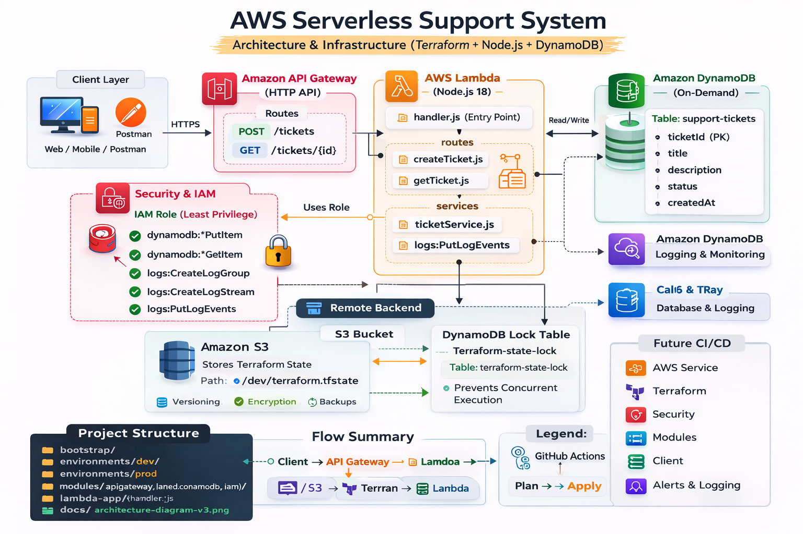
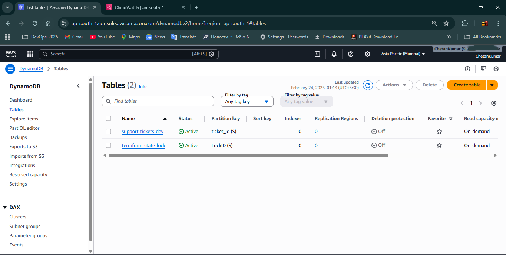

---
🚀 AWS Serverless Support System  
---
Production-Grade Serverless Ticketing API using Terraform  
---
🎯 Project Impact  
---
Designed and deployed a scalable, production-style serverless backend system on AWS using fully modular Terraform infrastructure.

This project simulates real-world DevOps engineering practices including:  

- Remote state management with locking  

- Environment isolation (Dev & Prod)  

- Least privilege IAM implementation  

- Secure and scalable serverless design  \

---
📌 Project Overview  
---
---

The AWS Serverless Support System is a fully automated ticketing API backend built using AWS serverless services and provisioned entirely with Terraform.

It provides two core endpoints:  

- POST /tickets → Create a support ticket  

- GET /tickets/{id} → Retrieve ticket information  

💡 What This Project Demonstrates  

- Infrastructure as Code (IaC)  

- Production-grade remote backend configuration  

- Secure IAM implementation (Least Privilege)  

- Multi-environment management  

- Auto-scaling serverless architecture  

- Cloud debugging using CloudWatch logs  

---
🏛 High-Level Architecture  
---
Serverless API flow:  

[` Client → API Gateway → Lambda → DynamoDB `]

Infrastructure flow:  

[` Terraform → S3 Remote Backend → DynamoDB State Lock `]

` Fully reproducible & version-controlled infrastructure `

---
# 🏗 Architecture Diagram
  Infrastructure & Application Flow



🔄 Request Flow

Client sends HTTPS request  

API Gateway triggers Lambda  

Lambda interacts with DynamoDB  

IAM enforces least privilege  

Logs stored in CloudWatch  

Terraform state stored in S3 with DynamoDB lock  

🧱 Project Structure
```
serverless-support-system/
│
├── bootstrap/              # Creates backend (S3 + lock table)
├── environments/
│     ├── dev/
│     └── prod/
├── modules/
│     ├── apigateway/
│     ├── dynamodb/
│     ├── iam/
│     └── lambda/
├── lambda-app/
├── docs/
└── screenshots/
```
✔ Modular  
✔ Environment isolated  
✔ Remote state secured  
✔ Production structured  

🔐 Remote Backend (Production Practice)  

Terraform state is stored in:  

S3 Bucket  

DynamoDB Table (State Locking)  

# Backend Screenshot    


This prevents:  

State corruption  

Parallel apply conflicts  

Accidental overwrites  

🌍 Environment Separation (Dev & Prod)  
Environment	API Gateway	DynamoDB Table
Dev	support-api-dev	support-tickets-dev
Prod	support-api-prod	support-tickets-prod

This ensures safe testing without affecting production.

# 🔎 Infrastructure Verification (Screenshots)  
🌐 API Gateway  

Environment Variables  


🗄 DynamoDB Table  

Item Stored  

📜 CloudWatch Logs  

🎟 Ticket Created Successfully  

🚧 Challenges Faced & Solutions  
1️⃣ Terraform State Lock Conflict  

Issue: Lock errors during apply
Solution:

Used terraform force-unlock

Separated state per environment

Implemented DynamoDB locking properly

2️⃣ IAM AccessDeniedException  

Issue: Lambda unable to access DynamoDB  
Solution:

Attached scoped IAM policy  

Restricted to specific table ARN  

Followed least privilege  

3️⃣ Lambda Code Not Updating  

Issue: Changes not reflected  
Solution:

Used source_code_hash  

Proper zip packaging  

4️⃣ API Gateway 500 Errors  

Cause: Missing Lambda permission  
Fix:

Added aws_lambda_permission resource  

5️⃣ Environment Variable Drift  

Issue: Dev & Prod mismatch  
Fix:

Parameterized variables properly  

💰 Cost Estimation (Monthly – Low Traffic)  
Service	Estimated Cost  
AWS Lambda (low usage)	~$0–2  
API Gateway	~$1–3  
DynamoDB (On-Demand)	~$1–4  
S3 (state storage)	<$1  
CloudWatch Logs	~$1  
Estimated Total: ~$5–10/month  

Why cost-effective?  

No EC2 servers  

No idle compute cost  

Fully managed services  

Pay-per-request model  

⚙️ How to Run This Project  
1️⃣ Clone Repository  
```
git clone https://github.com/<your-username>/serverless-support-system.git  
cd serverless-support-system
```
2️⃣ Configure AWS Credentials  
aws configure  

OR use environment variables:  
```
export AWS_ACCESS_KEY_ID=""
export AWS_SECRET_ACCESS_KEY=""
export AWS_DEFAULT_REGION="ap-south-1"
```
3️⃣ Bootstrap Backend (One Time)  
```
cd bootstrap
terraform init
terraform apply
```
This creates:  

S3 backend bucket  

DynamoDB lock table  

4️⃣ Deploy Dev Environment  
```
cd environments/dev
terraform init
terraform plan
terraform apply
```
5️⃣ Deploy Production   
```
cd environments/prod
terraform init
terraform plan
terraform apply
```

6️⃣ Test API  

Use Postman:  

POST /tickets  
GET /tickets/{id}  
📈 Why Serverless Architecture?  
✅ Auto Scaling  

Lambda scales automatically without manual intervention.  

✅ Cost Efficient  

Pay only when requests are processed.  

✅ High Availability  

AWS managed services provide built-in resilience.  

✅ No Server Management  

No patching, provisioning, or OS management.  

✅ Faster DevOps Delivery   

Combined with Terraform:  

Reproducible infra  

Version controlled infrastructure  

Easy multi-environment management  

🧠 What This Project Demonstrates  

✔ Production-level Terraform  
✔ Secure IAM implementation  
✔ Remote backend best practices  
✔ Debugging real AWS issues  
✔ Scalable serverless architecture  
✔ Clean DevOps repository structure  
